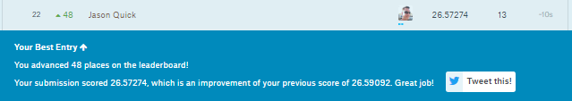

# Kaggle-Counting-Sea-Lions
Applying Computer Vision and Deep Learning to automate the population count for the endangered Steller Sea Lions.

[//]: # (Image References)

[im01]: ./github_pics/sea_lion_banner.jpg "Sea Lion Banner"
[im02]: ./github_pics/sea_lion_rank.png "Kaggle Sea Lion Rank"

![alt text][im01]

![alt text][im02]

[Kaggle Score](https://www.kaggle.com/jasonquick)

